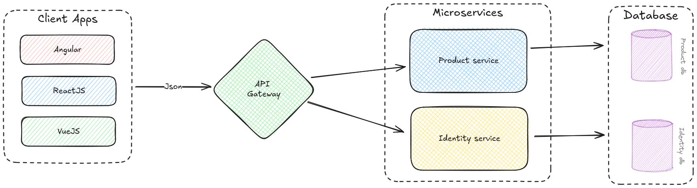

# Mechanical Keyboard Enthusiasts Platform - ASP.NET Core Microservices POC 

## Introduction

Welcome to the Mechanical Keyboard Enthusiasts Platform POC! This project is designed to provide a comprehensive platform for mechanical keyboard enthusiasts, enabling a vibrant community space, a detailed product catalog, customization tools, and build guides. The frontend is developed using Angular, while the backend is powered by .NET, with each service having its own separate database.

## Table of Contents

- [Introduction](#introduction)
- [Architecture](#architecture)
- [Services](#services)
- [Technologies](#technologies)
- [Setup and Installation](#setup-and-installation)
- [Workflows](#workflows)
  - [User Registration and Product Browsing (REST API)](#1-user-registration-and-product-browsing-rest-api)
  - [Customizing and Saving a Keyboard Design (REST API and Message Queue)](#2-customizing-and-saving-a-keyboard-design-rest-api-and-message-queue)
  - [Adding a New Product and Notifying Users (REST API and Message Queue)](#3-adding-a-new-product-and-notifying-users-rest-api-and-message-queue)
  - [Following a Build Guide and Posting Feedback (REST API)](#4-following-a-build-guide-and-posting-feedback-rest-api)
- [Usage](#usage)
- [Contributing](#contributing)
- [License](#license)

## Architecture

The platform is built using a microservices architecture to ensure scalability, flexibility, and maintainability. Each service is independent and communicates with others through API calls.

### Design Diagram



### Core Services

1. **Identity Service**
   - Handles user registration, authentication, and profile management.
   
2. **Product Service**
   - Manages the catalog of mechanical keyboard products, including keyboards, switches, keycaps, and accessories.
   
3. **Customization Tool Service**
   - Offers tools for designing and visualizing custom keyboard layouts, keycaps, and lighting setups.
   
4. **Build Guide Service**
   - Provides step-by-step guides and tutorials for building and modding mechanical keyboards.

## Technologies

### Frontend
- **Framework:** Angular
- **Language:** TypeScript
- **Styling:** SCSS/CSS
- **Build Tool:** Angular CLI

### Backend
- **Framework:** .NET
- **Language:** C#
- **Database:** Each service uses its own separate database (SQL Server, PostgreSQL, or MongoDB based on service needs)
- **API Communication:** RESTful APIs

## Setup and Installation

### Prerequisites

- Node.js and npm (for Angular)
- .NET SDK
- SQL Server/PostgreSQL/MongoDB (depending on the service)

### Frontend Setup

1. Clone the repository:
   ```bash
   git clone https://github.com/yourusername/mechanical-keyboard-platform.git
   cd mechanical-keyboard-platform/frontend```

2. Install dependencies
    ```bash
    npm install
    ```

3. Run the Angular application:
    ```bash
    ng serve
    ```

## Workflows

### 1. User Registration and Product Browsing (REST API)

#### User Registration

1. **Frontend:** User fills out the registration form on the Angular frontend.
2. **Frontend:** Form data is sent to the User Management Service via a POST request to `/api/users/register`.
3. **User Management Service:**
   - Validates the user data.
   - Creates a new user record in its database.
   - Responds with a success message or error.

#### Product Browsing

1. **Frontend:** User navigates to the product catalog page.
2. **Frontend:** Sends a GET request to the Product Service at `/api/products`.
3. **Product Service:**
   - Retrieves the product list from its database.
   - Returns the list of products to the frontend.
4. **Frontend:** Displays the products to the user.

### 2. Customizing and Saving a Keyboard Design (REST API and Message Queue)

#### Customizing a Keyboard

1. **Frontend:** User uses the customization tools to design a custom keyboard.
2. **Frontend:** The design data is temporarily saved locally until the user decides to save.

#### Saving the Design

1. **Frontend:** User clicks the "Save Design" button.
2. **Frontend:** Sends a POST request to the Customization Tool Service at `/api/customizations/save` with the design data.
3. **Customization Tool Service:**
   - Saves the custom design in its database.
   - Sends a message to the Message Queue to notify other services of the new design.
   - Responds to the frontend with a success message.

4. **Message Queue:**
   - The message contains details of the new custom design.

5. **Build Guide Service (Subscriber):**
   - Listens for messages from the queue.
   - Receives the new custom design message.
   - Optionally updates any related data or recommendations based on the new design.

### 3. Adding a New Product and Notifying Users (REST API and Message Queue)

#### Adding a New Product

1. **Frontend (Admin):** Admin user fills out a form to add a new product.
2. **Frontend (Admin):** Sends a POST request to the Product Service at `/api/products/add`.
3. **Product Service:**
   - Validates and saves the new product in its database.
   - Sends a message to the Message Queue about the new product.
   - Responds to the frontend with a success message.

4. **Message Queue:**
   - The message contains details of the new product.

#### Notifying Users

1. **Customization Tool Service (Subscriber):**
   - Listens for messages from the queue.
   - Receives the new product message.
   - Updates its internal catalog of available products for customization.

2. **User Management Service (Subscriber):**
   - Listens for messages from the queue.
   - Receives the new product message.
   - Sends notifications to users about the new product via email or in-app notifications.

### 4. Following a Build Guide and Posting Feedback (REST API)

#### Following a Build Guide

1. **Frontend:** User selects a build guide to follow.
2. **Frontend:** Sends a GET request to the Build Guide Service at `/api/buildguides/{guideId}`.
3. **Build Guide Service:**
   - Retrieves the guide details from its database.
   - Returns the guide details to the frontend.
4. **Frontend:** Displays the guide to the user.

#### Posting Feedback

1. **Frontend:** User completes the build and posts feedback.
2. **Frontend:** Sends a POST request to the Build Guide Service at `/api/buildguides/{guideId}/feedback` with the feedback data.
3. **Build Guide Service:**
   - Saves the feedback in its database.
   - Optionally sends a message to the Message Queue for any related updates or notifications.

4. **Message Queue:**
   - The message contains feedback details.

5. **Product Service (Subscriber):**
   - Listens for messages from the queue.
   - Receives the feedback message.
   - Updates product ratings or recommendations based on user feedback.

## Usage
After setting up, you can access the platform through http://localhost:4200. Use the provided tools to register, browse products, customize keyboards, and follow build guides.

## Contributing
We welcome contributions to the Mechanical Keyboard Enthusiasts Platform! Please fork the repository and submit pull requests for review.

## License
This project is licensed under the MIT License.
